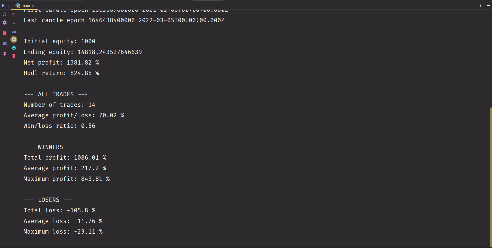

**Please read if you intend to use the code.**

Version 2 has a fully functional backtesting system and analysis tool.

Version 1 includes a backtesting system that is unreliable but remains in the repository because it includes the bot for live trading.

I had a hard time figuring out everything, wish ChatGPT existed back then :)

The bot uses the following libraries : pandas, numpy, matplotlib and ccxt.

Below are examples of backtesting output from v2.

This is a zoomed-in section of the chart generated. The green crosses indicate where the strategy has bought and the red ones where it has sold. The red line is the stop loss of the current position. This is a simple high-low flipper strategy. The blue line represents the highs and lows with a 50 candle period and the yellow line is an SMA100.

This is the console output of the same strategy.
