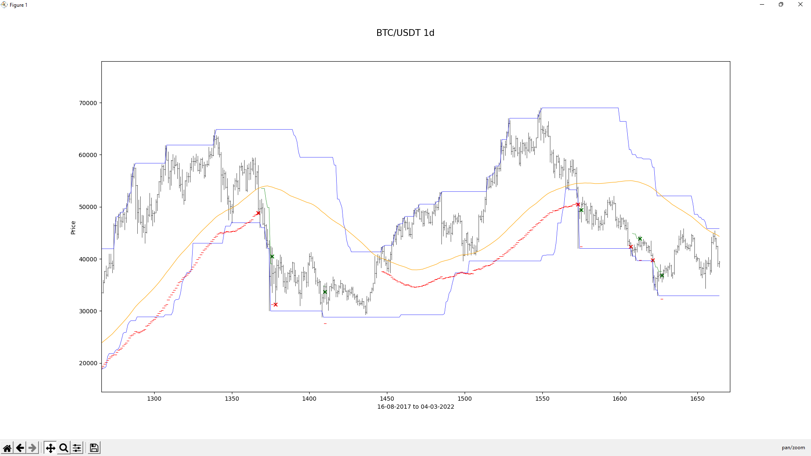
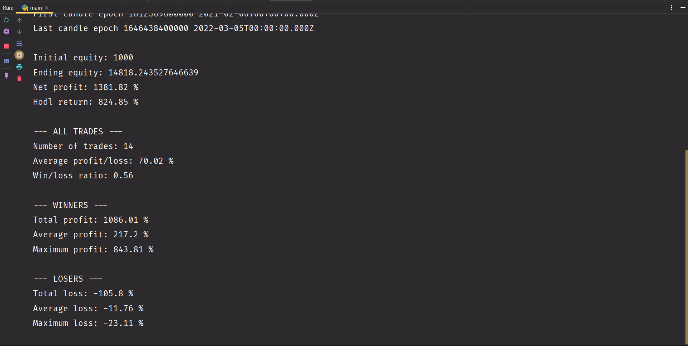

**Please read if you intend to use the code.**

Version 1 of the backstesting system and trading bot was coded in the fall of 2020. I realized the bot was not reliable when used live. The backtesting system was basically seeing into the future one candle ahead. A couple months after, I decided to code a new version of the bot. It has a backtesting system and an analysis tool that work well. Although the backtesting system in version 1 is flawed, it has more features than the second version. That is why I uploaded the code.

The bot uses the following libraries : pandas, numpy, matplotlib and ccxt.

Below are examples of backtesting output from version 2.

This is a zoomed-in section of the chart generated. The green crosses indicate where the strategy has bought and the red ones where it has sold. The red line is the stop loss of the current position. This is a simple high-low flipper strategy. The blue line represents the highs and lows with a 50 candle period and the yellow line is an SMA100.

This is the console output of the same strategy.